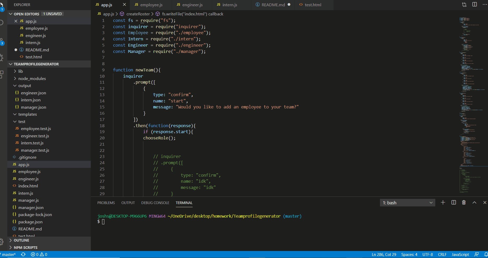

# Teamprofilegenerator
## Description
I have created this application to allow the manager of a team to quickly generate an HTML page that displays the roster of their current team so they have quick access to basic information about their team.

## Installation
In order to install this project simply navigate to the following [link](https://github.com/Jsegel9/Teamprofilegenerator) and clone the repository down and open in VS Code. Once open run the command "NPM Install" In order to install the necessary depencies.

## Usage
Once all dependencies have been installed open the root directory in the terminal and run the command "node app.js". Follow the following promps and enter the information requested about each employee, once you have entered info for each employee on your team answer "No" to the question whether or not you would like to enter another employee and then select the option "Generate Team". This will generate an index.html file with your team roster. Open this file in your browser in order to see the application in action.
A gif detailing usage can be found below.

## License
Copyright (c) [2019] [Joshua Patrick Segel]

Permission is hereby granted, free of charge, to any person obtaining a copy
of this software and associated documentation files (the "Software"), to deal
in the Software without restriction, including without limitation the rights
to use, copy, modify, merge, publish, distribute, sublicense, and/or sell
copies of the Software, and to permit persons to whom the Software is
furnished to do so, subject to the following conditions:

The above copyright notice and this permission notice shall be included in all
copies or substantial portions of the Software.

THE SOFTWARE IS PROVIDED "AS IS", WITHOUT WARRANTY OF ANY KIND, EXPRESS OR
IMPLIED, INCLUDING BUT NOT LIMITED TO THE WARRANTIES OF MERCHANTABILITY,
FITNESS FOR A PARTICULAR PURPOSE AND NONINFRINGEMENT. IN NO EVENT SHALL THE
AUTHORS OR COPYRIGHT HOLDERS BE LIABLE FOR ANY CLAIM, DAMAGES OR OTHER
LIABILITY, WHETHER IN AN ACTION OF CONTRACT, TORT OR OTHERWISE, ARISING FROM,
OUT OF OR IN CONNECTION WITH THE SOFTWARE OR THE USE OR OTHER DEALINGS IN THE
SOFTWARE.  
## Contributing
Feel free to use this github repository to build your own team profile generator. If you have any improvements or contributions you wild like to make please contact me at <Segeljosh@gmail.com>

